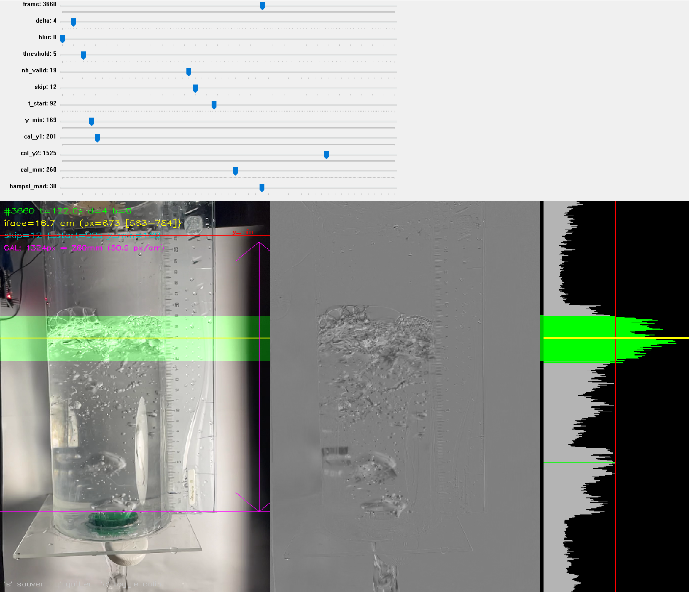
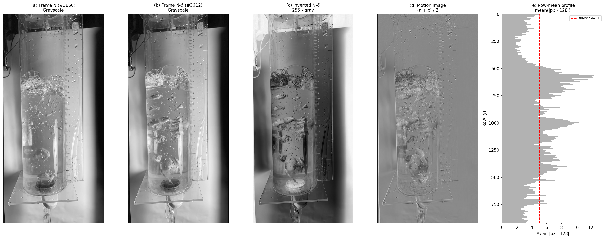
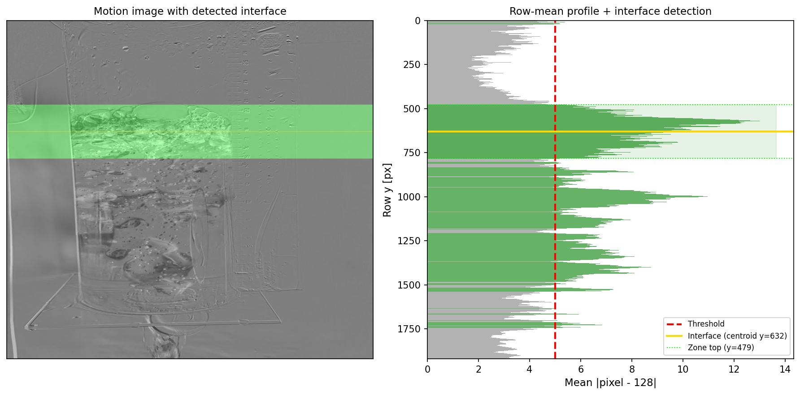
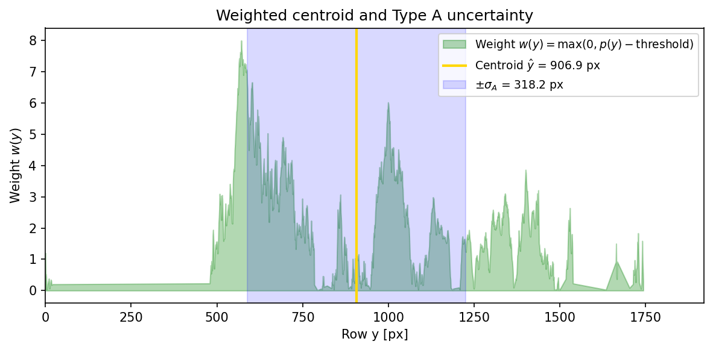

# Video Interface Tracker

Measure the position of an air/water interface in a vertical cylinder from video, with GUM-compliant uncertainties.



## Overview

This tool detects horizontal motion in a video by comparing consecutive frames, then locates the air/water interface as the first region of sustained movement. It outputs a calibrated height-vs-time plot with proper uncertainty bands.

**Key features:**
- Interactive parameter tuning with real-time preview (OpenCV)
- Spatial calibration from a ruler visible in the frame (px to cm)
- GUM-compliant uncertainty estimation (Type A + Type B)
- Hampel outlier rejection
- Publication-ready plots (PNG 300 dpi + PDF vector)

## Quick start

```bash
# 1. Drop your video in input/
cp my_video.mp4 motion_detection/input/

# 2. Tune parameters interactively
uv run python motion_detection/preview.py

# 3. Run the full analysis
uv run python motion_detection/analyze.py
```

Results appear in `output/`.

## Project structure

```
motion_detection/
  core.py             # Shared library (signal processing, I/O, calibration)
  preview.py          # Interactive parameter tuning (GUI)
  analyze.py          # Full analysis (CLI, with progress bar)
  params.json         # Saved parameters (auto-generated)
  input/              # Drop your video here (.mp4, .avi, .mov)
  output/             # Generated results
    annotated.mp4     #   Video with interface overlay
    interface_height.png  #   Height vs time plot (300 dpi)
    interface_height.pdf  #   Vector version
    interface_data.csv    #   Raw data
  docs/               # Documentation images
```

---

## Algorithm

### Step 1 — Frame differencing

For each frame N, the algorithm compares it to frame N-delta to detect what has moved.



The computation for each pixel is:

```
motion(x, y) = ( gray_N(x, y) + (255 - gray_{N-delta}(x, y)) ) / 2
```

**Why this formula?** It is equivalent to `128 + (gray_N - gray_{N-delta}) / 2`. Where nothing moves, both frames are identical and the result is exactly 128 (neutral gray). Where something moves, the pixel deviates from 128 — brighter or darker depending on the direction of the intensity change.

An optional Gaussian blur can be applied to the motion image to reduce noise.

### Step 2 — Row-mean profile

For each row `y` in the motion image, compute the mean absolute deviation from 128:

```
profile(y) = mean_over_x( |motion(x, y) - 128| )
```

This produces a 1D vertical profile where high values indicate rows with movement. In a vertical cylinder, the air/water interface appears as a horizontal band of high motion.

### Step 3 — Interface detection

The interface is detected by scanning the profile top-to-bottom:

1. Find the **first row** where `nb_valid` consecutive rows exceed the `threshold`.
2. Extend this zone to include all contiguous rows above threshold — defines `zone_top` and `zone_bottom`.
3. The interface position is the **weighted centroid** of this zone (see next section).



*Left: motion image with the detected zone (green) and interface line (yellow). Right: row-mean profile with threshold (red dashed), zone (green bars), and centroid (yellow line).*

### Step 4 — Weighted centroid (sub-pixel position)

Rather than taking the midpoint of the zone (which is sensitive to noise at the edges), the interface position is computed as a **weighted mean**:

```
y_hat = sum(y * w(y)) / sum(w(y))

where w(y) = max(0, profile(y) - threshold)
```

The weights are the excess of each row's mean above the threshold. Rows with stronger motion contribute more to the position estimate. This gives a **sub-pixel** position that is more stable than a simple midpoint.



*The weight distribution w(y) (green), centroid y_hat (yellow line), and +/- sigma_A (blue band).*

---

## Uncertainty estimation

Uncertainties follow the **GUM** (*Guide to the expression of Uncertainty in Measurement*, JCGM 100:2008).

### Type A — Statistical (per-frame)

The weighted standard deviation of the gradient distribution:

```
sigma_A = sqrt( sum(w(y) * (y - y_hat)^2) / sum(w(y)) )
```

This quantifies how spread out the motion zone is. A sharp interface gives small sigma_A; a turbulent, splashing interface gives large sigma_A.

### Type B — Calibration (systematic)

The pixel-to-cm conversion factor `k = cal_mm / |cal_y2 - cal_y1|` has an uncertainty from the placement of the two calibration markers (+/- 1 px each):

```
sigma_k / k = sqrt(2) / |cal_y2 - cal_y1|
```

For typical values (1300 px between markers), this is ~0.1% — usually negligible compared to Type A, but included for completeness.

The Type B contribution in cm is:

```
sigma_B = h_cm * (sigma_k / k)
```

### Combined uncertainty

```
u = sqrt(sigma_A^2 + sigma_B^2)    [in cm]
```

The plot shows bands at +/- u (68%) and +/- 2u (95%).

### Outlier rejection — Hampel filter

Before plotting, outliers are removed using a **Hampel filter** (median-based, non-parametric):

- For each point, compute the local median and MAD (Median Absolute Deviation) over a window of 7 points.
- A point is an outlier if `|y_i - median| > k * MAD`, where k is configurable (default 3.0, adjustable via the `hampel_mad` slider in tenths: 30 = 3.0, 20 = 2.0).
- Outliers are silently removed from the plot.

---

## Calibration

The tool converts pixel positions to centimeters using two reference points placed on a ruler visible in the video frame.

### Procedure

1. Navigate to a frame where the ruler/scale is clearly visible.
2. Place `cal_y1` (magenta line) on a **known graduation** near the top of the cylinder.
3. Place `cal_y2` (magenta line) on a **known graduation** at the bottom — this becomes the **zero reference** (e.g., bottom of the cylinder).
4. Set `cal_mm` to the **real distance** between those two marks in millimeters.

The interface height is then:

```
h [cm] = (cal_y2 - y_centroid) / px_per_cm
```

where `px_per_cm = |cal_y2 - cal_y1| / (cal_mm / 10)`.

Values are measured from `cal_y2` (the physical zero), not from the bottom of the image.

---

## Interactive preview (preview.py)


The preview window has three panels:

| Panel | Content |
|-------|---------|
| **Left** | Original frame with green zone overlay, yellow interface line, magenta calibration lines, red y_min line |
| **Center** | Motion image (gray = static, deviations = movement) |
| **Right** | Row-mean profile (horizontal bars), threshold (red), interface (yellow), zone extent (green strip) |

### Sliders

| Slider | Range | Description |
|--------|-------|-------------|
| `frame` | 0 — N | Navigate through the video |
| `delta` | 1 — 120 | Frame offset for differencing (higher = detects slower motion) |
| `blur` | 0 — 30 | Gaussian blur kernel half-size on the motion image |
| `threshold` | 0 — 80 | Minimum row-mean value to count as "motion" |
| `nb_valid` | 1 — 50 | Consecutive rows above threshold required to validate interface |
| `skip` | 1 — 30 | Process every N-th frame (1 = all frames) |
| `t_start` | 0 — duration | Start analysis from this second (skip initial frames) |
| `y_min` | 0 — H | Ignore detections above this row (filters top-of-frame artifacts) |
| `cal_y1` | 0 — H | Upper calibration marker position [px] |
| `cal_y2` | 0 — H | Lower calibration marker position (= physical zero) [px] |
| `cal_mm` | 1 — 500 | Real distance between cal_y1 and cal_y2 [mm] |
| `hampel_mad` | 1 — 50 | Outlier rejection threshold in tenths of MAD (30 = 3.0 MAD) |

### Keyboard shortcuts

| Key | Action |
|-----|--------|
| `n` | Next frame |
| `p` | Previous frame |
| `s` | Save parameters to `params.json` |
| `q` | Quit (auto-saves) |

Parameters are stored in `params.json` and persist between sessions.

---

## Analysis output (analyze.py)

Run the full analysis from the command line:

```bash
uv run python motion_detection/analyze.py
```

```
Video    : input/Video 6 (1st glug).MP4
          1080x1920, 30.0 fps, 6085 frames total
Params   : delta=4, blur=0, threshold=5.0, nb_valid=19
           skip=12, t_start=92s (frame 2760)
Calib    : 1324px = 260mm => 50.9 px/cm
           278 frames to process
Output   : output/

  [##################################################] 278/278 (100%)
  Video saved : output/annotated.mp4

  Uncertainty statistics:
    sigma_A mean = 1.25 cm
    sigma_B mean = 0.015 cm
    u mean       = 1.28 cm
    Outliers Hampel : 5/247 (2.0%)
  Plot saved   : output/interface_height.png
  Plot PDF     : output/interface_height.pdf
```

### Output plot


- **Blue dots**: measured interface position (weighted centroid)
- **Dark green band**: +/- u (68% confidence)
- **Light green band**: +/- 2u (95% confidence)
- Bottom-left: number of valid points, mean uncertainty, calibration
- Bottom-right: analysis parameters

### Output CSV

`output/interface_data.csv` contains raw data with columns:

| Column | Unit | Description |
|--------|------|-------------|
| `time_s` | s | Time since `t_start` |
| `centroid_px` | px | Interface position (weighted centroid) |
| `sigma_A_px` | px | Type A uncertainty |
| `zone_top_px` | px | Top of the motion zone |
| `zone_bottom_px` | px | Bottom of the motion zone |

---

## Requirements

- Python >= 3.10
- OpenCV (`opencv-python`)
- NumPy
- Matplotlib
- SciPy

Install with [uv](https://docs.astral.sh/uv/):

```bash
uv sync
```

## License

MIT
